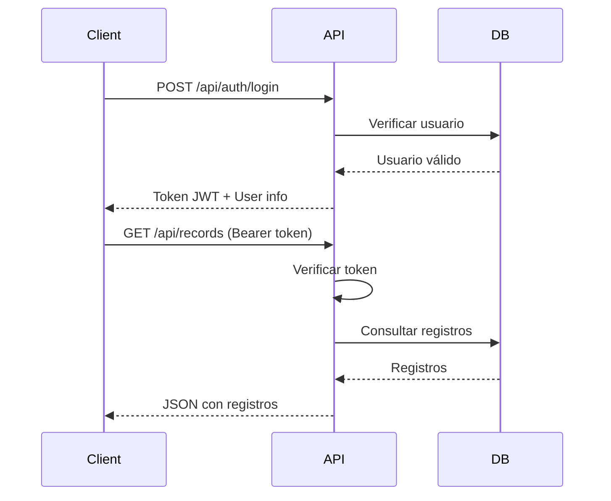

# 📚 Documentación API - Sistema Contable Inteligente

## 🚀 Inicio Rápido

### Instalación y Ejecución

```bash
cd backend
npm install
npm start
```

El servidor se ejecutará en `http://localhost:3000`

### Credenciales Demo

- **Administrador**: `admin@trimpulso.cl` / `demo123`
- **Usuario**: `user@trimpulso.cl` / `demo123`

---

## 🔐 Autenticación

Todas las rutas protegidas requieren un token JWT en el header:

```
Authorization: Bearer {token}
```

### POST /api/auth/login

Iniciar sesión y obtener token JWT.

**Request Body:**
```json
{
  "email": "admin@trimpulso.cl",
  "password": "demo123"
}
```

**Response:**
```json
{
  "token": "eyJhbGciOiJIUzI1NiIsInR5cCI6IkpXVCJ9...",
  "user": {
    "id": 1,
    "email": "admin@trimpulso.cl",
    "name": "Administrador",
    "role": "admin"
  }
}
```

**Status Codes:**
- `200`: Login exitoso
- `400`: Email/password faltantes
- `401`: Credenciales inválidas
- `500`: Error del servidor

---

### POST /api/auth/logout

Cerrar sesión (requiere autenticación).

**Headers:**
```
Authorization: Bearer {token}
```

**Response:**
```json
{
  "message": "Sesión cerrada"
}
```

---

### GET /api/auth/me

Obtener perfil del usuario autenticado.

**Headers:**
```
Authorization: Bearer {token}
```

**Response:**
```json
{
  "id": 1,
  "email": "admin@trimpulso.cl",
  "name": "Administrador",
  "role": "admin"
}
```

**Status Codes:**
- `200`: Éxito
- `401`: Token inválido/expirado
- `404`: Usuario no encontrado

---

## 📊 Registros Contables

### GET /api/records

Listar registros con paginación y filtros (requiere autenticación).

**Headers:**
```
Authorization: Bearer {token}
```

**Query Parameters:**
| Parámetro | Tipo | Default | Descripción |
|-----------|------|---------|-------------|
| `page` | number | 1 | Página actual |
| `limit` | number | 100 | Registros por página |
| `rut` | string | - | Filtrar por RUT emisor (búsqueda parcial) |
| `fecha_desde` | string | - | Fecha mínima (YYYY-MM-DD) |
| `fecha_hasta` | string | - | Fecha máxima (YYYY-MM-DD) |
| `estado` | string | - | Filtrar por Estado RCV |

**Ejemplo:**
```
GET /api/records?page=1&limit=50&rut=76192801&fecha_desde=2025-10-01
```

**Response:**
```json
{
  "records": [
    {
      "id": 1,
      "RUT_Emisor": "76192801-K",
      "Razon_Social_Emisor": "Proveedor A S.A.",
      "Tipo_DTE": "Factura Electrónica",
      "Folio_DTE": "1234",
      "Fecha_Emision": "2025-10-01",
      "Fecha_Recepcion": "2025-10-02",
      "Monto_Neto": 500000,
      "Monto_IVA": 95000,
      "Monto_Total": 595000,
      "Estado_RCV": "Registrada",
      "Codigo_Impto": "IVA",
      "sheet_name": "Hoja1",
      "imported_at": "2025-01-08T05:00:00.000Z",
      "user_id": 1
    }
  ],
  "pagination": {
    "page": 1,
    "limit": 50,
    "total": 3,
    "pages": 1
  }
}
```

---

### GET /api/records/:id

Obtener un registro específico (requiere autenticación).

**Headers:**
```
Authorization: Bearer {token}
```

**Response:**
```json
{
  "id": 1,
  "RUT_Emisor": "76192801-K",
  "Razon_Social_Emisor": "Proveedor A S.A.",
  "Tipo_DTE": "Factura Electrónica",
  "Folio_DTE": "1234",
  "Fecha_Emision": "2025-10-01",
  "Monto_Total": 595000,
  ...
}
```

**Status Codes:**
- `200`: Éxito
- `401`: No autenticado
- `404`: Registro no encontrado

---

## 📈 Estadísticas

### GET /api/stats/summary

Resumen general de estadísticas (requiere autenticación).

**Headers:**
```
Authorization: Bearer {token}
```

**Response:**
```json
{
  "total_registros": 3,
  "monto_total": 1785000,
  "monto_promedio": 595000,
  "por_estado": [
    {
      "estado": "Registrada",
      "count": 2,
      "monto_total": 1190000
    },
    {
      "estado": "Pendiente",
      "count": 1,
      "monto_total": 595000
    }
  ]
}
```

---

### GET /api/stats/by-month

Estadísticas agrupadas por mes (últimos 12 meses, requiere autenticación).

**Headers:**
```
Authorization: Bearer {token}
```

**Response:**
```json
[
  {
    "mes": "2025-10",
    "registros": 2,
    "monto_total": 1190000
  },
  {
    "mes": "2025-11",
    "registros": 1,
    "monto_total": 595000
  }
]
```

---

### GET /api/stats/by-provider

Top proveedores por monto total (requiere autenticación).

**Headers:**
```
Authorization: Bearer {token}
```

**Query Parameters:**
| Parámetro | Tipo | Default | Descripción |
|-----------|------|---------|-------------|
| `limit` | number | 10 | Cantidad de proveedores a retornar |

**Ejemplo:**
```
GET /api/stats/by-provider?limit=5
```

**Response:**
```json
[
  {
    "proveedor": "Proveedor A S.A.",
    "registros": 2,
    "monto_total": 1190000
  },
  {
    "proveedor": "Proveedor B Ltda.",
    "registros": 1,
    "monto_total": 595000
  }
]
```

---

## 🚨 Sistema de Alertas de Seguridad

### POST /api/security/analyze

Analizar un DTE individual y generar alertas de seguridad (requiere autenticación).

**Headers:**
```
Authorization: Bearer {token}
```

**Request Body:**
```json
{
  "RUT_Emisor": "88999888-7",
  "Razon_Social_Emisor": "Empresa Fantasma SpA",
  "Tipo_DTE": "Factura Electrónica",
  "Folio_DTE": "9999",
  "Fecha_Emision": "2025-11-01",
  "Fecha_Recepcion": "2025-11-01",
  "Monto_Neto": 15000000,
  "Monto_IVA": 2850000,
  "Monto_Total": 17850000,
  "Estado_RCV": "Pendiente",
  "Codigo_Impto": "IVA",
  "Region_Emisor": "Magallanes",
  "Es_Nuevo_Proveedor": "SI"
}
```

**Response:**
```json
{
  "timestamp": "2025-11-08T06:00:00.000Z",
  "dte": {
    "rut": "88999888-7",
    "razonSocial": "Empresa Fantasma SpA",
    "folio": "9999",
    "monto": 17850000
  },
  "evaluacion": {
    "riesgoScore": 100,
    "nivel": "CRÍTICO",
    "cantidadAlertas": 5,
    "requiereAprobacion": true,
    "bloqueado": true
  },
  "alertas": [
    {
      "alerta": true,
      "tipo": "EMISOR_NUEVO",
      "nivel": "ADVERTENCIA",
      "icono": "🆕",
      "mensaje": "Emisor nuevo: Empresa Fantasma SpA (88999888-7) no tiene historial en el sistema",
      "accion": "Verificar existencia en SII y validar actividad comercial"
    },
    {
      "alerta": true,
      "tipo": "REGION_DIFERENTE",
      "nivel": "ADVERTENCIA_MEDIA",
      "icono": "🌍",
      "mensaje": "Emisor ubicado en región Magallanes (fuera de zona operacional habitual)",
      "accion": "Verificar razón comercial para operación en esta región"
    },
    {
      "alerta": true,
      "tipo": "MONTO_ANORMAL_GENERAL",
      "nivel": "ADVERTENCIA_ALTA",
      "icono": "💰",
      "mensaje": "Monto $17.850.000 excede 3x el promedio general ($595.000)",
      "accion": "Requiere aprobación manual y verificación de orden de compra"
    },
    {
      "alerta": true,
      "tipo": "RECEPCION_INMEDIATA",
      "nivel": "ADVERTENCIA",
      "icono": "⏱️",
      "mensaje": "DTE recibido el mismo día de emisión (patrón inusual)",
      "accion": "Verificar autenticidad del documento en portal SII"
    },
    {
      "alerta": true,
      "tipo": "FOLIO_SOSPECHOSO",
      "nivel": "ADVERTENCIA",
      "icono": "📄",
      "mensaje": "Folio 9999 tiene patrón sospechoso (números repetidos)",
      "accion": "Verificar autenticidad del folio"
    }
  ],
  "recomendacion": "🚨 BLOQUEAR REGISTRO AUTOMÁTICO. Verificar existencia en SII; Verificar razón comercial para operación en esta región; Requiere aprobación manual y verificación de orden de compra; Verificar autenticidad del documento en portal SII; Verificar autenticidad del folio. Requiere validación por supervisor antes de continuar.",
  "acciones": [
    {
      "tipo": "EMISOR_NUEVO",
      "mensaje": "Emisor nuevo: Empresa Fantasma SpA (88999888-7) no tiene historial en el sistema",
      "accion": "Verificar existencia en SII y validar actividad comercial"
    },
    {
      "tipo": "REGION_DIFERENTE",
      "mensaje": "Emisor ubicado en región Magallanes (fuera de zona operacional habitual)",
      "accion": "Verificar razón comercial para operación en esta región"
    }
  ]
}
```

**Reglas de Detección:**

| Regla | Criterio | Score | Nivel |
|-------|----------|-------|-------|
| **Emisor Nuevo** 🆕 | RUT no existe en historial | +30 | Advertencia |
| **Región Diferente** 🌍 | Región != RM, Valparaíso, O'Higgins | +20 | Advertencia Media |
| **Monto Anormal** 💰 | Monto > 3x promedio del emisor/general | +40 | Advertencia Alta |
| **Recepción Inmediata** ⏱️ | Fecha emisión == Fecha recepción | +10 | Advertencia |
| **Folio Sospechoso** 📄 | Números repetidos (9999, 1111) | +15 | Advertencia |
| **Pendiente Monto Alto** ⚠️ | Estado Pendiente + Monto > $5M | +25 | Advertencia Alta |
| **IVA Incorrecto** 🧮 | IVA != 19% Monto Neto | +30 | Advertencia Alta |
| **Razón Social Sospechosa** 🏢 | Contiene: fantasma, dudoso, temporal | +20 | Advertencia Media |

**Niveles de Riesgo:**
- `0-20`: ✅ **BAJO** - Aprobar automáticamente
- `21-50`: ⚠️ **MEDIO** - Revisar manualmente
- `51-100`: 🚨 **CRÍTICO** - Bloquear hasta validación

---

### POST /api/security/analyze-batch

Analizar múltiples DTEs simultáneamente (requiere autenticación).

**Headers:**
```
Authorization: Bearer {token}
```

**Request Body:**
```json
{
  "dtes": [
    {
      "RUT_Emisor": "88999888-7",
      "Razon_Social_Emisor": "Empresa Fantasma SpA",
      "Monto_Total": 17850000,
      ...
    },
    {
      "RUT_Emisor": "99888777-K",
      "Razon_Social_Emisor": "Proveedor Dudoso Ltda.",
      "Monto_Total": 29750000,
      ...
    }
  ]
}
```

**Response:**
```json
{
  "resultados": [
    {
      "RUT_Emisor": "88999888-7",
      "Razon_Social_Emisor": "Empresa Fantasma SpA",
      "analisisSeguridad": {
        "riesgoScore": 100,
        "nivel": "CRÍTICO",
        "bloqueado": true,
        "alertas": [...]
      }
    }
  ],
  "estadisticas": {
    "total": 2,
    "bloqueados": 2,
    "requierenAprobacion": 2,
    "porNivel": {
      "CRÍTICO": 2,
      "MEDIO": 0,
      "BAJO": 0
    },
    "porTipo": {
      "EMISOR_NUEVO": 2,
      "REGION_DIFERENTE": 2,
      "MONTO_ANORMAL_GENERAL": 2
    },
    "scorePromedio": 95
  }
}
```

---

### GET /api/records/with-alerts

Obtener solo registros que tienen alertas de seguridad (requiere autenticación).

**Headers:**
```
Authorization: Bearer {token}
```

**Query Parameters:**
| Parámetro | Tipo | Default | Descripción |
|-----------|------|---------|-------------|
| `page` | number | 1 | Página actual |
| `limit` | number | 100 | Registros por página |

**Response:**
```json
{
  "records": [
    {
      "id": 3,
      "RUT_Emisor": "88999888-7",
      "Razon_Social_Emisor": "Empresa Fantasma SpA",
      "Monto_Total": 17850000,
      "analisisSeguridad": {
        "riesgoScore": 100,
        "nivel": "CRÍTICO",
        "bloqueado": true,
        "alertas": [...]
      }
    }
  ],
  "pagination": {
    "page": 1,
    "limit": 100,
    "total": 2,
    "pages": 1
  },
  "estadisticas": {
    "total": 2,
    "bloqueados": 2,
    "requierenAprobacion": 2
  }
}
```

---

### GET /api/security/stats

Obtener estadísticas globales del sistema de alertas (requiere autenticación).

**Headers:**
```
Authorization: Bearer {token}
```

**Response:**
```json
{
  "total": 5,
  "bloqueados": 2,
  "requierenAprobacion": 2,
  "porNivel": {
    "CRÍTICO": 2,
    "MEDIO": 0,
    "BAJO": 3
  },
  "porTipo": {
    "EMISOR_NUEVO": 2,
    "REGION_DIFERENTE": 2,
    "MONTO_ANORMAL_GENERAL": 2,
    "RECEPCION_INMEDIATA": 3,
    "FOLIO_SOSPECHOSO": 2
  },
  "scorePromedio": 42.5,
  "proveedoresConocidos": 4,
  "registrosAnalizados": 5,
  "promedioGeneral": 595000
}
```

---

## ⚙️ Configuración

### Variables de Entorno

Crear archivo `.env` en la raíz del proyecto backend:

```env
PORT=3000
JWT_SECRET=mi-secreto-super-seguro-cambiar-en-produccion
ALLOWED_ORIGINS=http://localhost:8000,https://trimpulso.github.io
```

### Seguridad

- **Helmet**: Headers de seguridad HTTP
- **CORS**: Orígenes permitidos configurables
- **Rate Limiting**: Máximo 100 requests por 15 minutos por IP
- **JWT**: Tokens con expiración de 24 horas
- **Bcrypt**: Contraseñas hasheadas con 10 rounds

---

## 🧪 Testing

### Script de Pruebas

```bash
# Pruebas generales
node test-api.js

# Pruebas del sistema de alertas
node test-security.js
```

Prueba todos los endpoints automáticamente.

### Prueba Manual con cURL (Windows PowerShell)

```powershell
# Login
$response = Invoke-RestMethod -Uri "http://localhost:3000/api/auth/login" -Method POST -ContentType "application/json" -Body '{"email":"admin@trimpulso.cl","password":"demo123"}'
$token = $response.token

# Get records
Invoke-RestMethod -Uri "http://localhost:3000/api/records" -Headers @{Authorization="Bearer $token"}

# Get stats
Invoke-RestMethod -Uri "http://localhost:3000/api/stats/summary" -Headers @{Authorization="Bearer $token"}
```

---

## 🔄 Flujo de Autenticación Completo



---

## 📝 Códigos de Estado HTTP

| Código | Significado |
|--------|-------------|
| 200 | Éxito |
| 400 | Datos inválidos/faltantes |
| 401 | No autenticado / Token inválido |
| 404 | Recurso no encontrado |
| 500 | Error del servidor |

---

## 🚨 Manejo de Errores

Todos los endpoints retornan errores en formato JSON:

```json
{
  "error": "Descripción del error"
}
```

**Ejemplo - Token expirado:**
```json
{
  "error": "Token expirado"
}
```

---

## 💡 Próximas Mejoras

- [ ] Endpoints POST/PUT/DELETE para records (actualmente solo GET)
- [ ] Exportación de reportes en PDF/Excel
- [ ] WebSockets para actualizaciones en tiempo real
- [ ] Migración a base de datos PostgreSQL/MongoDB
- [ ] Documentación interactiva con Swagger/OpenAPI
- [ ] Tests automatizados con Jest
- [ ] Rate limiting por usuario (además de por IP)
- [ ] Refresh tokens

---

## 📞 Soporte

Para issues o preguntas: [GitHub Issues](https://github.com/Trimpulso/Contabilidad/issues)

---

**Versión:** 2.0.0  
**Última actualización:** 2025-11-08  
**Nuevas funcionalidades:** Sistema de Alertas de Seguridad
